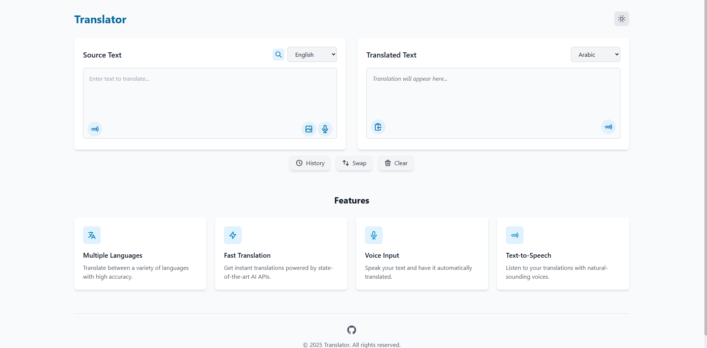

# 🌐 Translator Web App



✨ A responsive web application for translating text between multiple languages. This app features a clean, modern interface with dark mode support, voice input, text-to-speech capabilities, and is fully responsive across devices.

## ✅ Features

- 📱 **Responsive Design**: Works seamlessly on desktop, tablet, and mobile devices
- 🌓 **Dark/Light Mode**: Toggle between dark and light themes with automatic system preference detection
- 🗣️ **Multiple Languages**: Support for translating between various languages
- 🎙️ **Voice Input**: Speak your text directly for translation using speech recognition
- 🔊 **Text-to-Speech**: Listen to your translations with natural-sounding voices
- 🎭 **File Support**: Extract text from images, PDFs, Word documents, and text files
- ✨ **Animated UI**: Modern interface with smooth transitions, animations, and interactive elements
- ♿ **Accessibility**: Focus states and keyboard navigation support

## 🛠️ Technologies Used

- **HTML5**: Semantic markup structure
- **CSS3/Tailwind CSS**: For styling, responsive design, and animations
- **JavaScript**: For interactivity, theme switching, and speech functionality
- **Web Speech API**: For speech recognition and text-to-speech capabilities
- **OCR API**: For extracting text from images and documents
- **Translation APIs**: MyMemory Translation API for performing translations

## 🚀 Getting Started

1. Clone this repository
   ```bash
   git clone https://github.com/yourusername/translator-app.git
   ```
2. Open `index.html` in your browser
3. Start translating! 🎉

## 🎯 How to Use

### 🔄 Basic Translation
1. Enter text in the source language box
2. Select source and target languages from dropdown menus
3. See your translation appear automatically!

### 🎙️ Voice Input
1. Click the microphone icon in the source text area
2. Speak clearly in the selected source language
3. Your speech will be transcribed automatically
4. Translation appears as you speak!

### 🔊 Text-to-Speech
1. Translate some text
2. Click the speaker icon in the translated text area
3. Listen to the translation in the target language

### 📄 Document Translation
1. Click the upload icon
2. Select an image, PDF, Word document, or text file
3. The app will extract and translate the text automatically!

## ✨ Animations & UI Features

The app includes various animations for a modern user experience:
- ⭐ Page load animations with staggered timing
- 👆 Interactive button animations with feedback
- ✨ Hover effects on cards and buttons
- 🔄 Visual feedback during translation process
- 🌓 Smooth dark mode toggle animations

## 🔮 Future Enhancements

- 🧠 Advanced machine learning translation
- 📱 Mobile app version
- 📝 Enhanced document formatting preservation
- 🌍 Support for more languages
- 🎛️ User accounts to save preferences

## 🌐 Browser Support

This application works in all modern browsers including:
- Google Chrome (recommended for full speech recognition support)
- Mozilla Firefox
- Apple Safari
- Microsoft Edge

> **Note**: Speech recognition features work best in Chrome and Edge browsers.

## 🤝 Contributing

Contributions are welcome! Feel free to open an issue or submit a pull request if you have any improvements or bug fixes.

---


